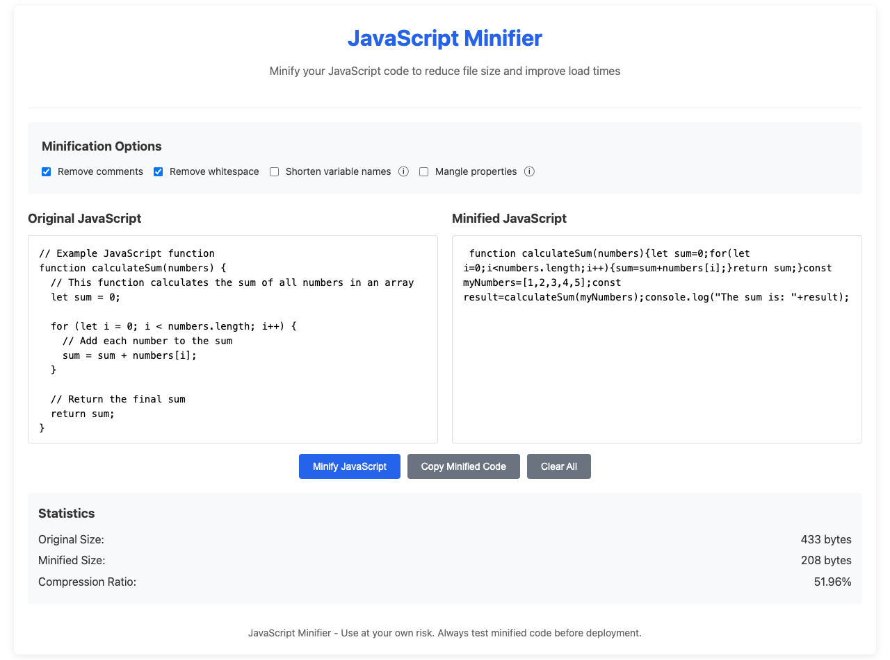

# JavaScript Minifier

A tool to minify JavaScript code by removing comments, whitespace, and optionally shortening variable names and mangling properties.

## Features

- Remove comments
- Remove unnecessary whitespace
- Shorten variable names (experimental)
- Mangle object properties (experimental)
- Real-time size and compression statistics
- Copy to clipboard functionality
- Clear all fields

## Usage

1. Paste your JavaScript code into the "Original JavaScript" textarea
2. Select desired minification options:
   - Remove comments (enabled by default)
   - Remove whitespace (enabled by default)
   - Shorten variable names (experimental)
   - Mangle properties (experimental)
3. Click "Minify JavaScript" to process the code
4. View the minified code in the "Minified JavaScript" textarea
5. Use the "Copy Minified Code" button to copy the result to clipboard
6. Use "Clear All" to reset the tool

## Example

### Input
```javascript
// Example JavaScript function
function calculateSum(numbers) {
  // This function calculates the sum of all numbers in an array
  let sum = 0;
  
  for (let i = 0; i < numbers.length; i++) {
    // Add each number to the sum
    sum = sum + numbers[i];
  }
  
  // Return the final sum
  return sum;
}
```

### Output (with all options enabled)
```javascript
function a(b){let c=0;for(let d=0;d<b.length;d++)c=c+b[d];return c}
```

## Limitations

- Variable name shortening and property mangling are experimental features
  - May break code in some cases
  - Always test minified code before deployment
- Does not handle complex JavaScript features like:
  - ES6+ syntax (arrow functions, classes, etc.)
  - Module imports/exports
  - Advanced optimizations like tree-shaking

## Security Considerations

- All processing happens locally in your browser
- No code is sent to external servers
- Be cautious when using experimental features in production code
- Always test minified code thoroughly

## Screenshot


