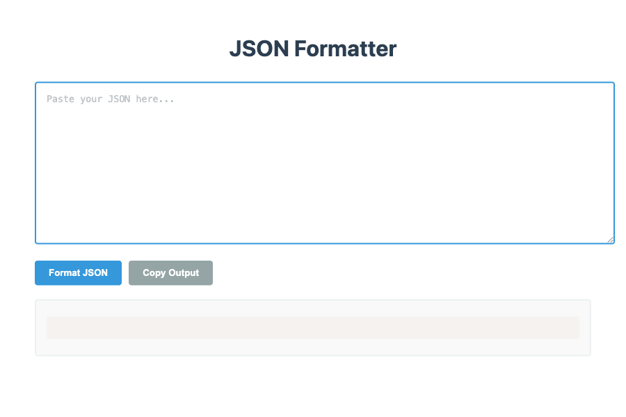

# JSON Formatter

A tool for formatting and validating JSON data with optional alphabetical key sorting and interactive node collapsing.

## Privacy & Security
- 🔒 **100% Client-Side Processing**: All JSON formatting and validation happens in your browser
- 🚫 **No Server Storage**: Your JSON data is never saved or transmitted to any server
- 💻 **Offline Support**: Fully functional without internet connection once loaded
- 🔐 **Zero Data Collection**: No cookies, tracking, or data persistence of any kind

## Features
- Pretty-print JSON with proper indentation (2 spaces)
- Optional alphabetical sorting of object keys (enabled by default)
- Validate JSON syntax with detailed error messages
- Copy formatted output to clipboard with success confirmation
- Collapsible/expandable JSON nodes for better navigation
- Size comparison between original and formatted JSON
- Load sample data for quick testing
- Download formatted JSON as a file
- Mobile-responsive design
- Shared notification system for consistent user feedback

## Usage
1. Paste your JSON into the input area
2. Toggle "Sort Keys" checkbox to enable/disable alphabetical sorting
3. Click "Format JSON" to validate and format
   - The tool will automatically validate the JSON syntax
   - If valid, it will format with proper indentation (2 spaces)
   - Object keys will be sorted alphabetically if enabled
4. Use "Copy Output" button to copy formatted JSON
   - Uses modern Clipboard API with execCommand fallback
   - A temporary success message will appear when copied
5. Click "Download" to save formatted JSON as a file
   - Downloads as "formatted.json" with application/json MIME type
6. Click "Sample Data" to load example JSON for testing
   - Loads a comprehensive sample with nested objects and arrays
7. Invalid JSON will show specific error messages
   - The error message will indicate the exact issue
   - Uses shared notification system for consistent display

## Example Input
```json
{"z":1,"a":{"d":2,"c":3},"b":[4,3,2]}
```

## Example Output (with sorting enabled)
```json
{
  "a": {
    "c": 3,
    "d": 2
  },
  "b": [
    4,
    3,
    2
  ],
  "z": 1
}
```

## Sample Data Structure
The "Load Sample" button loads this structure:
```json
{
  "userProfile": {
    "id": 12345,
    "username": "johndoe",
    "email": "john.doe@example.com",
    "isActive": true,
    "joinDate": "2024-03-16T20:37:00Z",
    "preferences": {
      "theme": "dark",
      "notifications": {
        "email": true,
        "push": false,
        "frequency": "daily"
      },
      "language": "en-US"
    }
  },
  "posts": [
    {
      "id": "p123",
      "title": "My First Post",
      "content": "Hello World!",
      "tags": ["welcome", "introduction"],
      "likes": 42,
      "timestamp": "2024-03-16T15:30:00Z",
      "comments": null
    },
    {
      "id": "p124",
      "title": "JSON Formatting Guide",
      "content": "Learn how to format JSON properly...",
      "tags": ["tutorial", "json", "coding"],
      "likes": 128,
      "timestamp": "2024-03-16T18:45:00Z",
      "comments": [
        {
          "user": "alice",
          "text": "Great tutorial!",
          "timestamp": "2024-03-16T19:00:00Z"
        }
      ]
    }
  ],
  "stats": {
    "totalPosts": 2,
    "totalLikes": 170,
    "averagePostLength": 256.5,
    "topTags": ["json", "tutorial", "welcome"]
  }
}
```

## Size Comparison
The tool shows:
- Original size (bytes/KB/MB)
- Formatted size (bytes/KB/MB)

Calculation methodology:
- Uses Blob API to calculate exact byte sizes
- Converts to appropriate units (bytes, KB, MB, GB, TB)
- Shows 2 decimal places for KB and larger
- Updates in real-time during input and formatting

## Technical Implementation Details

### Sorting Algorithm
- Recursively sorts all object keys alphabetically
- Preserves array element order
- Handles nested objects and arrays
- Case-sensitive sorting (A-Z before a-z)
- Does not modify primitive values

### Node Collapsing
- Interactive toggle buttons (▼/▶) for each object/array
- Nested content is indented (15px per level)
- Toggle state changes button text (+/-)
- Uses CSS classes for expanded/collapsed states
- Preserves structure during re-formatting

### Error Handling
- Catches and displays JSON.parse errors
- Shows specific error messages including:
  - Unexpected tokens
  - Missing brackets/braces
  - Invalid string escapes
  - Number formatting issues
- Preserves input during errors for easy correction
- Disables output buttons on invalid JSON

### Clipboard Integration
1. Attempts modern Clipboard API first (requires HTTPS/localhost)
2. Falls back to document.execCommand for older browsers
3. Shows appropriate success/error notifications
4. Handles special characters and newlines properly

### Download Functionality
- Creates Blob with application/json type
- Generates temporary object URL
- Uses hidden anchor element to trigger download
- Automatically cleans up resources
- Downloads as "formatted.json"
- Shows success/error notifications

## Current Limitations
- Large JSON files (>10MB) may impact performance
- Array elements are never sorted (only object keys when enabled)
- Clipboard operations require secure context (HTTPS or localhost)
- Comments in JSON are not supported (as per JSON specification)
- Does not preserve trailing commas
- Unicode characters in strings are not escaped/unescaped
- No support for JSON5 or JSON with comments (JSONC)
- No syntax highlighting (basic text rendering only)

## UI Components
- Uses shared component classes (c- prefix) for consistency
- Shared styles from `common/shared-styles.css`
- Tool-specific styles in `styles.css`
- Notification system from `common/notification-manager.js`
- Responsive design works on mobile and desktop

## Browser Support
- **Modern Browsers**: Chrome, Firefox, Safari, Edge
- **Requirements**:
  - JavaScript enabled
  - For copy functionality:
    - Primary: Modern Clipboard API (secure context - HTTPS or localhost)
    - Fallback: execCommand (older browsers/HTTP contexts)
- **Mobile Support**: Fully responsive design with touch-friendly controls

## Accessibility
- **Keyboard Navigation**:
  - Tab navigation through interactive elements
  - Space/Enter to trigger buttons and toggles
  - Focus management for error messages
- **ARIA Support**:
  - Expandable/collapsible sections use proper ARIA attributes
  - Error messages are properly announced
  - Copy success notifications are screen-reader friendly
- **Visual Indicators**:
  - Clear focus states
  - High contrast toggle indicators (▼/▶)
  - Error messages with distinct styling


