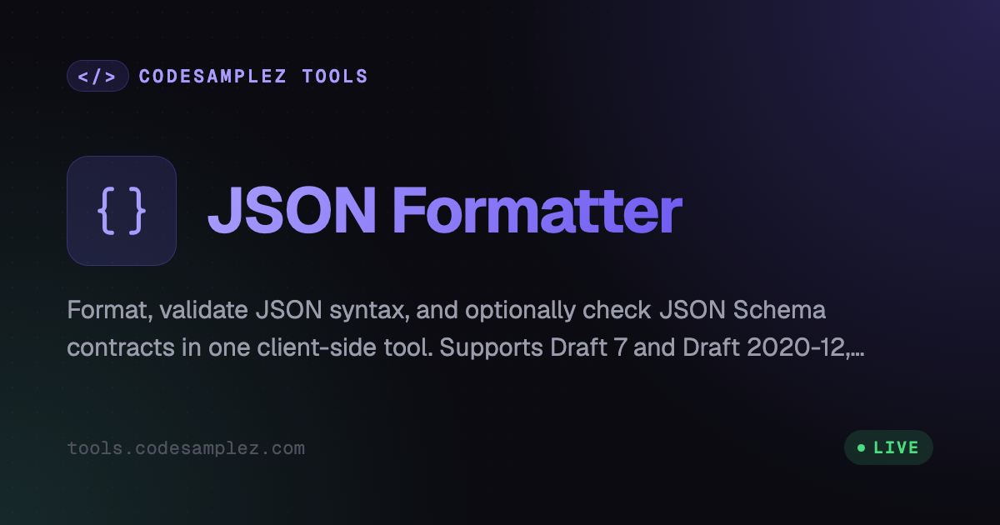

# JSON Formatter

A browser-based JSON Formatter with optional Draft 7 / Draft 2020-12 JSON Schema validation, alphabetical key sorting, and interactive node collapsing.

## Privacy & Security
- 🔒 **100% Client-Side Processing**: JSON formatting and JSON Schema validation happen in your browser
- 🚫 **No Tool-Side Storage or Upload**: JSON and schema text are not saved or transmitted by this formatter
- 💻 **Offline Support**: Formatting works without an internet connection once loaded; schema validation works after its lazy validator chunk has loaded
- 🔐 **Schema Privacy**: Schema text and draft selection are not persisted and never appear in Share links
- 🔗 **Private Sharing**: The "Share" link stores JSON and formatter settings in the URL's hash fragment, which browsers never send to a server

## Features
- Pretty-print JSON with selectable indentation (2 spaces, 4 spaces, or Tab)
- Minify JSON to a compact single line (the "Minified" indentation option)
- Optional alphabetical sorting of object keys (enabled by default)
- Auto-fix common JSON errors (enabled by default)
- Validate strict JSON syntax with detailed error messages, including the line/column and a "Go to error" jump
- Optionally validate strict raw JSON against Draft 7 or Draft 2020-12 JSON Schema; report the first JSON Pointer/rule/message/source position
- Auto-detect `$schema` declarations (Draft 7 when missing), support fragment-local `$ref`/`$defs`/`definitions`, and reject external references without fetching
- Copy formatted output to clipboard with success confirmation
- Collapsible/expandable JSON nodes, plus Expand All / Collapse All controls
- Size comparison between original and formatted JSON
- Load sample data for quick testing
- Download formatted JSON as a file
- Shareable URLs: compress the current JSON + settings into the URL's hash fragment for private, client-side-only sharing
- Mobile-responsive design
- Shared notification system for consistent user feedback
- Click "Upload File" or drag a file onto the input to load and format it; the
  file is read in the browser and never uploaded (5 MB limit, binary files rejected)

## Usage
1. Paste your JSON into the input area, or click "Upload File" to choose a local text file
2. Toggle "Sort Keys" checkbox to enable/disable alphabetical sorting
3. Toggle "Auto fix" checkbox to enable/disable automatic error correction.
4. Choose an "Indent" option (2 spaces, 4 spaces, Tab, or Minified)
5. Optionally expand "JSON Schema validation", paste or upload a schema, and leave Draft on "Auto-detect" or choose Draft 7 / Draft 2020-12
   - Schema text stays local, is not saved, and is not included in Share links
6. Click "Format JSON" without a schema, or "Format & Validate" with a schema
   - The tool always validates JSON syntax
   - With a schema, the validator checks strict raw JSON and reports only the first actionable violation
   - If Auto fix was needed, formatted output is still shown but schema validation waits until the source is valid JSON
   - If valid, it will format with the selected indentation (defaults to 2 spaces)
   - Choosing "Minified" produces compact single-line JSON and switches to Plain View
   - Object keys will be sorted alphabetically if enabled
7. In Tree View, use "Expand All" / "Collapse All" to fold or unfold every node at once
8. Use "Copy Output" button to copy formatted JSON
   - Uses modern Clipboard API with execCommand fallback
   - A temporary success message will appear when copied
9. Click "Download" to save formatted JSON as a file
   - Downloads as "formatted.json" with application/json MIME type
10. Click "Sample Data" to load example JSON for testing
   - Loads a comprehensive sample with nested objects and arrays
11. Invalid JSON or schema diagnostics will show specific messages
   - The error message will indicate the exact issue
   - Uses shared notification system for consistent display
12. Click "Share" to copy a shareable link with your current JSON and settings
    - The JSON and settings (indent, sort keys, auto fix) are LZ-compressed into the URL's hash fragment (`#j=...`), which browsers never send to a server
    - Opening the link auto-populates the input, restores the settings, and formats automatically
    - Blocked with an error notification if the compressed payload would make the URL impractically long (over ~8,000 characters) — use Download instead for very large JSON

## Example Input
```json
{"z":1,"a":{"d":2,"c":3},"b":[4,3,2]}
```

## Example Output (with sorting enabled)
```json
{
  "a": {
    "c": 3,
    "d": 2
  },
  "b": [
    4,
    3,
    2
  ],
  "z": 1
}
```

## Sample Data Structure
The "Load Sample" button loads this structure:
```json
{
  "userProfile": {
    "id": 12345,
    "username": "johndoe",
    "email": "john.doe@example.com",
    "isActive": true,
    "joinDate": "2024-03-16T20:37:00Z",
    "preferences": {
      "theme": "dark",
      "notifications": {
        "email": true,
        "push": false,
        "frequency": "daily"
      },
      "language": "en-US"
    }
  },
  "posts": [
    {
      "id": "p123",
      "title": "My First Post",
      "content": "Hello World!",
      "tags": ["welcome", "introduction"],
      "likes": 42,
      "timestamp": "2024-03-16T15:30:00Z",
      "comments": null
    },
    {
      "id": "p124",
      "title": "JSON Formatting Guide",
      "content": "Learn how to format JSON properly...",
      "tags": ["tutorial", "json", "coding"],
      "likes": 128,
      "timestamp": "2024-03-16T18:45:00Z",
      "comments": [
        {
          "user": "alice",
          "text": "Great tutorial!",
          "timestamp": "2024-03-16T19:00:00Z"
        }
      ]
    }
  ],
  "stats": {
    "totalPosts": 2,
    "totalLikes": 170,
    "averagePostLength": 256.5,
    "topTags": ["json", "tutorial", "welcome"]
  }
}
```

## Size Comparison
The tool shows:
- Original size (bytes/KB/MB)
- Formatted size (bytes/KB/MB)

Calculation methodology:
- Uses Blob API to calculate exact byte sizes
- Converts to appropriate units (bytes, KB, MB, GB, TB)
- Shows 2 decimal places for KB and larger
- Updates in real-time during input and formatting

## Technical Implementation Details

### Sorting Algorithm
- Recursively sorts all object keys alphabetically
- Preserves array element order
- Handles nested objects and arrays
- Case-sensitive sorting (A-Z before a-z)
- Does not modify primitive values

### Node Collapsing
- Interactive toggle buttons (▼/▶) for each object/array
- "Expand All" / "Collapse All" toolbar controls fold or unfold every node at once
- Nested content is indented (15px per level)
- Toggle state changes button text (+/-)
- Uses CSS classes for expanded/collapsed states
- Preserves structure during re-formatting

### Error Handling
- Catches and displays JSON.parse errors
- Shows specific error messages including:
  - Unexpected tokens
  - Missing brackets/braces
  - Invalid string escapes
  - Number formatting issues
- Preserves input during errors for easy correction
- Disables output buttons on invalid JSON
- Reports the exact line and column of the first syntax error
- Shows a "Go to error" button that focuses the input, scrolls to the error line, and selects the offending character (jump-to-error)
- Stale-run safety: each format run carries a monotonic run id; a run superseded by a newer one drops its result or error entirely (including while the worker chunk is still loading), so a slow run's failure never paints "Invalid JSON" over a newer run's output or disables its controls

### JSON Schema Validation
- Uses a dedicated lazily loaded Web Worker with Ajv 8 and `json-source-map`; the existing formatting worker and initial bundle do not include the validator.
- Supports Draft 7 and Draft 2020-12 with separate Ajv dialect implementations. `$schema` is auto-detected, with Draft 7 as the missing-declaration default. When that default is used and the schema contains Draft 2020-12-only keywords that Draft 7 ignores (`prefixItems`, `unevaluatedProperties`, `dependentRequired`, …), a passing result is reported as a warning naming them.
- Validates strict raw JSON with no data mutation, one actionable error (`allErrors: false`), and `format` treated as annotation (`validateFormats: false`).
- Supports fragment-local `$ref`, `$defs`, and `definitions`; external references are rejected and never fetched.
- Limits schemas to 256 KiB and depth 100, with a five-second worker deadline. A timeout or unavailable worker reports `unavailable` and never runs Ajv on the main thread.
- Invalid JSON, invalid schemas, unsupported drafts, and schema violations preserve any formatted output. Violations include JSON Pointer, rule, message, and a line/column jump into the input.

### Clipboard Integration
1. Attempts modern Clipboard API first (requires HTTPS/localhost)
2. Falls back to document.execCommand for older browsers
3. Shows appropriate success/error notifications
4. Handles special characters and newlines properly

### Shareable URLs
- Implemented in `share-url.ts`, imported by `script.tsx`, built on the shared hash/query-fallback and LZ-compression helpers in `common/share-url.ts` — the same module base64-converter's `#data=`/`?data=` preload links use, so both tools follow one convention instead of each reinventing it
- The current input JSON plus the indent/sort-keys/auto-fix settings are JSON-stringified, then LZ-compressed via `common/share-url.ts`'s `compressJsonPayload` (`lz-string`'s `compressToEncodedURIComponent`)
- The compressed payload is appended to the URL as a hash-fragment param (`#j=...`) — hash fragments are never transmitted to a server, preserving the 100% client-side privacy story. A legacy `?j=...` query-string fallback is also read (mirroring base64-converter's `?data=` fallback), with a notification recommending the hash form when a query-string link is used
- On load, `script.tsx` calls `loadFromShareLocation(window.location)`, which resolves the payload from the hash (preferred) or query string, decompresses it, populates the input/settings, and formats automatically; malformed or tampered payloads are silently ignored rather than throwing
- A size guard (`SHARE_URL_MAX_LENGTH`, ~8,000 characters, defined in `common/share-url.ts`) blocks generating a share link when the compressed payload would make the URL impractically long, showing an error notification suggesting Download instead

### Download Functionality
- Creates Blob with application/json type
- Generates temporary object URL
- Uses hidden anchor element to trigger download
- Automatically cleans up resources
- Downloads as "formatted.json"
- Shows success/error notifications

## Current Limitations
- Very large JSON files may still impact performance, but formatting above ~50,000 characters is offloaded to a Web Worker (`format.worker.ts` via `format-runner.ts`) — the parse/sort/stringify runs off the main thread, with an automatic main-thread fallback if the worker is unavailable. Smaller inputs format synchronously. Building the tree view still happens on the main thread (chunked via `nextFrame`).
- Array elements are never sorted (only object keys when enabled)
- Clipboard operations require secure context (HTTPS or localhost)
- Comments in JSON are not supported (as per JSON specification)
- The auto-fix feature is not a full JSON5 parser and may not fix all syntax errors.
- Unicode characters in strings are not escaped/unescaped
- JSON5 and JSONC syntax are not supported; Auto fix is intentionally limited and is not a full JSON5 parser

## UI Components
- Uses shared component classes (c- prefix) for consistency
- Shared styles from `common/shared-styles.css`
- Tool-specific styles in `styles.css`
- Notification system from `common/notification-manager`
- Responsive design works on mobile and desktop

## Browser Support
- **Modern Browsers**: Chrome, Firefox, Safari, Edge
- **Requirements**:
  - JavaScript enabled
  - For copy functionality:
    - Primary: Modern Clipboard API (secure context - HTTPS or localhost)
    - Fallback: execCommand (older browsers/HTTP contexts)
- **Mobile Support**: Fully responsive design with touch-friendly controls

## Accessibility
- **Keyboard Navigation**:
  - Tab navigation through interactive elements
  - Space/Enter to trigger buttons and toggles
  - Focus management for error messages
- **ARIA Support**:
  - Expandable/collapsible sections use proper ARIA attributes
  - Error messages are properly announced
  - Copy success notifications are screen-reader friendly
- **Visual Indicators**:
  - Clear focus states
  - High contrast toggle indicators (▼/▶)
  - Error messages with distinct styling

## Testing & Validation

Run the dedicated test suite for JSON Formatter:

```bash
# Run unit tests
npm test -- json-formatter

# Typecheck
npm run typecheck
```


