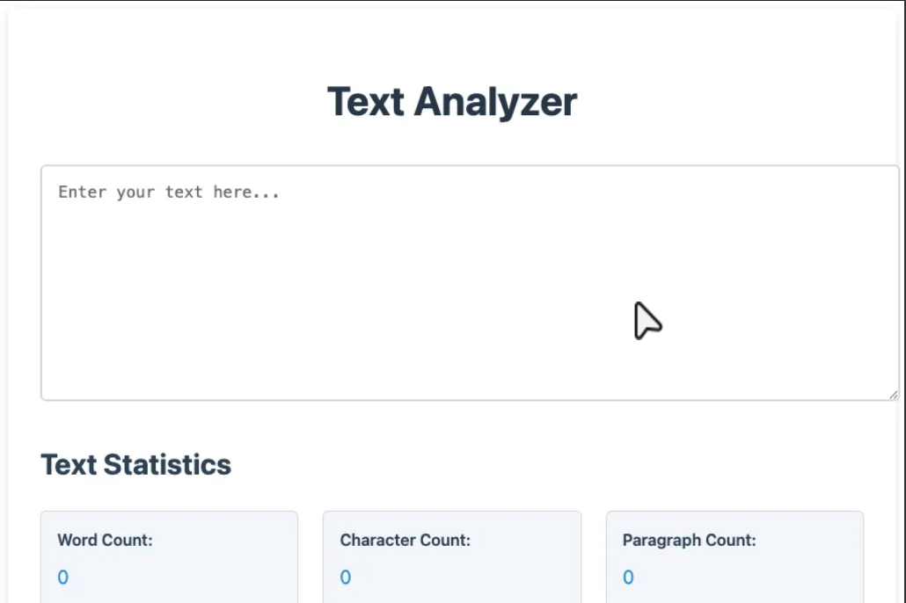

# Text Analyzer

A lightweight, browser-based text analysis tool that provides real-time statistics about your text using Web Workers for optimal performance.



## Privacy & Security
- 🔒 **100% Client-Side Processing**: All text analysis happens locally in your browser using Web Workers
- 🚫 **No Data Storage**: Your text is never saved or transmitted to any server
- 💻 **Offline Support**: Works without internet connection after initial page load
- 🔐 **Zero Data Collection**: No cookies, tracking, or data persistence
- 🧹 **Session Privacy**: All text is cleared when you close the browser tab

## Features

- **Character Count**: Counts every character in the text, including spaces and punctuation
- **Word Count**: Calculates the number of words by splitting text on whitespace
- **Sentence Count**: Estimates the number of sentences by identifying common sentence endings (., !, ?)
- **Line Count**: Tracks the number of lines in the text based on line breaks
- **Paragraph Count**: Counts paragraphs by identifying text blocks separated by blank lines
- **Average Word Length**: Calculates the mean length of words (excluding punctuation)
- **Average Sentence Length**: Computes the average number of words per sentence
- **Punctuation Statistics**: Tracks usage frequency of common punctuation marks (periods, commas, question marks, exclamation marks)

## Browser Requirements

This tool requires a modern browser with **Web Worker support**. Supported browsers include:
- Chrome 4+
- Firefox 3.5+
- Safari 4+
- Edge (all versions)
- Opera 10.6+

## Usage

### Online
1. Visit [Codesamplez.com/tools/text-analyzer](https://codesamplez.com/tools/text-analyzer)
2. Enter or paste your text in the textarea
3. Click "Analyze Text" to get comprehensive statistics
4. View real-time results displayed below the input area

### Local Development
1. Clone the repository
2. Install dependencies: `npm install`
3. Start the development server: `npm run dev`
4. Visit `http://localhost:8081` in your browser
5. Navigate to the Text Analyzer tool

## Development

### Prerequisites
- Node.js (v14 or higher)
- npm (v6 or higher)
- Modern browser with Web Worker support

### Setup
1. Clone the repository
2. Install dependencies: `npm install`
3. Build the project: `npm run build`
4. Run tests: `npm test`

### Testing
Tests are written using Jest:
- Run all tests: `npm test`
- Run text analyzer tests specifically: `npm test text-analyzer`
- View test coverage: `npm run test:coverage`

All test files are located in the same directory as their implementation files.

## How It Works

The tool uses a **Web Worker-based architecture** for optimal performance:

- **Main Thread**: Handles UI interactions and displays results
- **Web Worker**: Performs all text analysis computations to prevent UI blocking
- **Shared Analysis Logic**: Self-contained worker with embedded analysis algorithms

### Performance Optimization

- **Non-blocking Analysis**: All text processing happens in a Web Worker to keep the UI responsive
- **Result Caching**: Identical text analysis results are cached to avoid redundant processing
- **Error Handling**: Comprehensive error handling with user-friendly notifications
- **Loading Indicators**: Visual feedback during analysis operations

## Architecture

The application follows a simplified, modern architecture:

- **HTML5**: Semantic markup for accessibility and SEO, using shared classes where applicable.
- **CSS**: Leverages shared styles from `common/shared-styles.css` for base elements, layout, and common components (buttons, notifications). Tool-specific styles or overrides are located in `text-analyzer-tool/styles.css`. Follows BEM methodology.
- **JavaScript**: Vanilla JS with modular class-based design and Web Worker integration.

### Key Components

```javascript
// Main UI Controller
class TextAnalyzerUI {
    constructor() {
        this.initWorker();
        this.initializeEventListeners();
    }
    
    initWorker() {
        this.worker = new Worker('./text-analyzer.worker.js');
        this.worker.onmessage = (e) => {
            this.updateUI(e.data.data);
        };
    }
    
    updateCounts() {
        this.worker.postMessage(this.textInput.value);
    }
}

// Web Worker (text-analyzer.worker.js)
function analyzeText(text) {
    // Comprehensive text analysis logic
    return {
        charCount, wordCount, sentenceCount,
        paragraphCount, avgWordLength, avgSentenceLength,
        periodCount, commaCount, questionCount, exclamationCount
    };
}

self.onmessage = function(e) {
    const result = analyzeText(e.data);
    self.postMessage({ success: true, data: result });
};
```

### File Structure

```
text-analyzer-tool/
├── index.html              # Main HTML structure
├── styles.css              # Tool-specific styles
├── script.js               # Entry point and initialization
├── TextAnalyzerUI.js       # Main UI controller class
├── text-analyzer.worker.js # Self-contained Web Worker
├── TextAnalyzerUI.test.js  # UI component tests
├── script.test.js          # Integration tests
└── images/
    └── text-analyzer.png   # Tool screenshot
```

## Limitations

- **Browser Compatibility**: Requires Web Worker support (not available in very old browsers)
- **Word Count Accuracy**: Word count is approximate and may not handle all international writing systems perfectly
- **Sentence Detection**: Basic sentence detection that may not catch all edge cases (e.g., abbreviations with periods)
- **Line Count**: Includes empty lines in the count

## Future Improvements

- **Advanced Word Analysis**: 
  - Reading time estimation
  - Readability scoring (Flesch-Kincaid, etc.)
  - Keyword density analysis
  
- **Export Capabilities**:
  - Export analysis results as CSV/PDF
  - Save text with statistics for later reference
  
- **UI Enhancements**:
  - Dark mode support
  - Customizable text area size
  - Multiple document comparison
  
- **Language Support**:
  - Multi-language support for word/sentence detection
  - Special character handling for different writing systems

## Technical Notes

- **Web Worker Path**: The worker file is automatically copied during the build process
- **Error Handling**: Graceful degradation with informative error messages
- **Performance**: Optimized for large text processing without blocking the main thread
- **Memory Management**: Efficient text processing with minimal memory footprint
